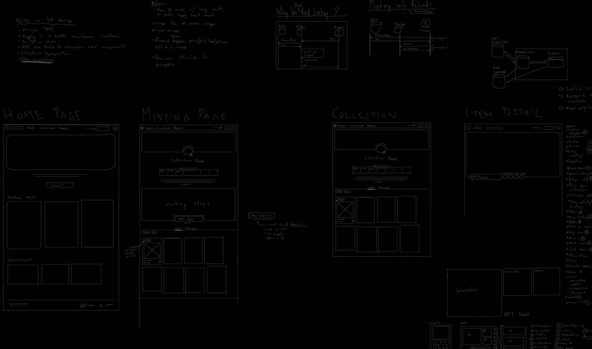

# Progenitus Client



The client application for Saga Tarot's _Project Progenitus_, the minting platform or "launchpad" for the Legends NFT series.

## Local Development

**Don't transfer funds to your account in local dev!** You'll lose ICP 😆.

This app is built with:

- vitejs
- react
- typescript
- zustand

To begin developing locally:

```sh
git clone git@github.com:sagacards/progenitus-client.git
cd progenitus-client
npm i
npm run dev
```

This will give you a functioning version of the app on your local machine, visit: http://localhost:3000.

### Storybook

We are also trying out Storybook as another option for exploring the project's components and views (as well as providing documentation and integration testing).

```sh
# How to do storybook...
```

### Local Backend

To have a fully functioning client application, we need a progenitus backend that we can speak to. You can point at the production canister, and this is the default option. You can also run your Progenitus client against a local version of the the [Progenitus canister]() by configuring the local canister ID and running the `npm run dev:local` command.

```sh
# some command the configures the local canister id. this should store the canister id in a local file which is ignore in git for future use
npm run dev:local
```

- [ ] **TODO: this**

## Contribution

Let's try to follow [Conventional Commits](https://www.conventionalcommits.org/en/v1.0.0/#summary). Use one of these prefixes for commit messages:

- fix: 
- feat: 
- build: 
- chore: 
- ci: 
- docs: 
- style: 
- refactor: 
- perf: 
- test: 